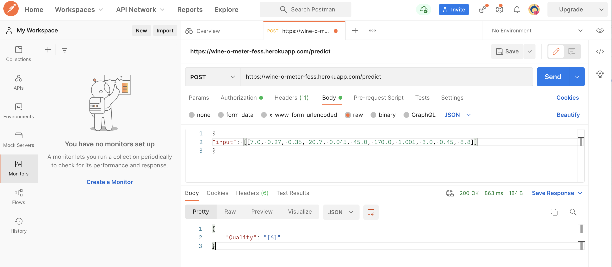

curl -i -H "Content-Type: application/json" -X POST -d '{"input": [[7.0, 0.27, 0.36, 20.7, 0.045, 45.0, 170.0, 1.001, 3.0, 0.45, 8.8]]}' https://wine-o-meter-fess.herokuapp.com/predict

Postman https://web.postman.co Workspace

https://wine-o-meter-fess.herokuapp.com/predict

body 
{"input": [[7.0, 0.27, 0.36, 20.7, 0.045, 45.0, 170.0, 1.001, 3.0, 0.45, 8.8]]}
<<<<<<< HEAD

=======
>>>>>>> 97b31426d00a6a9c5cbb99fb4c8517c1564e5ce3
